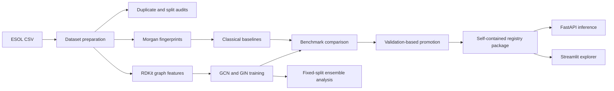
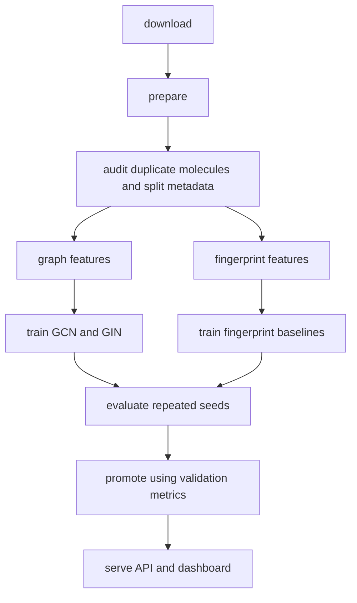
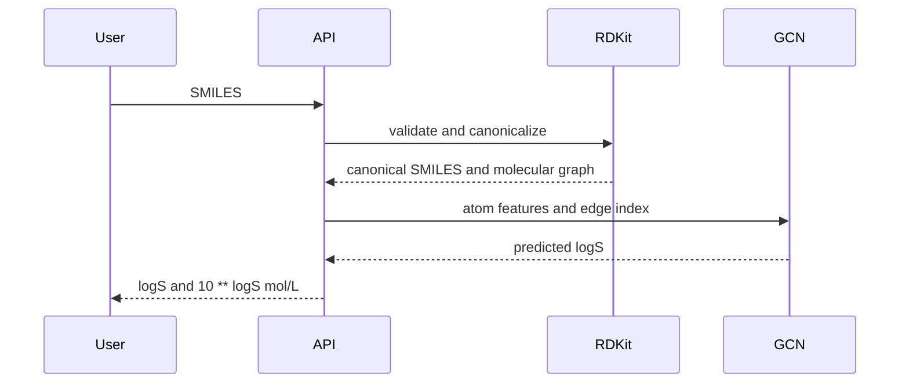
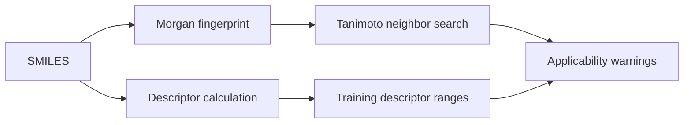
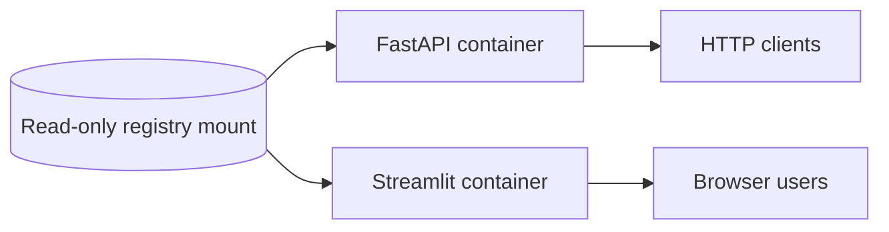

# Architecture

## Component Overview



## Data Flow



Generated benchmark artifacts live under `artifacts/` and are ignored by Git. Small portfolio
summaries live under `reports/portfolio/` and are tracked so the repository remains readable
without requiring large local model artifacts.

## Inference Flow



The API rejects blank or invalid SMILES. It does not expose uncertainty values because the
ensemble disagreement experiment did not support a reliable confidence story.

## Applicability Flow



The nearest-neighbor context uses the training reference index packaged with the promoted
model. Similarity and descriptor-range warnings are descriptive applicability context, not
confidence.

## Promoted Registry Structure

```text
artifacts/registry/esol-gcn-v1/
  manifest.json
  candidate_ranking.csv
  selection_report.md
  featurization_config.json
  models/esol-gcn-v1/
    checkpoint.pt
    reference_index.npz
```

The registry package is self-contained for inference. It records the checkpoint location
relative to the manifest, atom and edge feature dimensions, architecture settings,
normalization metadata, validation metrics, and post-selection test metrics.

## API, Dashboard, And Containers



The API and dashboard use the same Docker image with different commands. The image contains
runtime dependencies but not generated models or datasets. Compose mounts the registry
read-only into each service.

## Tracked Versus Generated

Tracked in Git:

- source code, tests, scripts, CI workflows
- docs and release metadata
- small portfolio summaries in `reports/portfolio/`

Generated and ignored:

- downloaded datasets
- trained checkpoints
- benchmark artifacts
- promoted registry contents
- demo outputs

## Seed Semantics

`split_seed` controls the train/validation/test partition. `model_seed` controls parameter
initialization, batch order, dropout, and other training randomness. Repeated-split
benchmarks vary seeds for benchmark comparison, while the fixed-split ensemble keeps the
partition immutable and varies only model seeds.

## Why Stable IDs Matter For Uncertainty

The uncertainty pipeline requires identical sample IDs, canonical molecules, targets, and
split labels across every ensemble member. ESOL contains duplicate canonical molecules,
including conflicting measurements. Aligning predictions by SMILES alone can combine the
wrong rows. Stable sample IDs prevent that failure.

